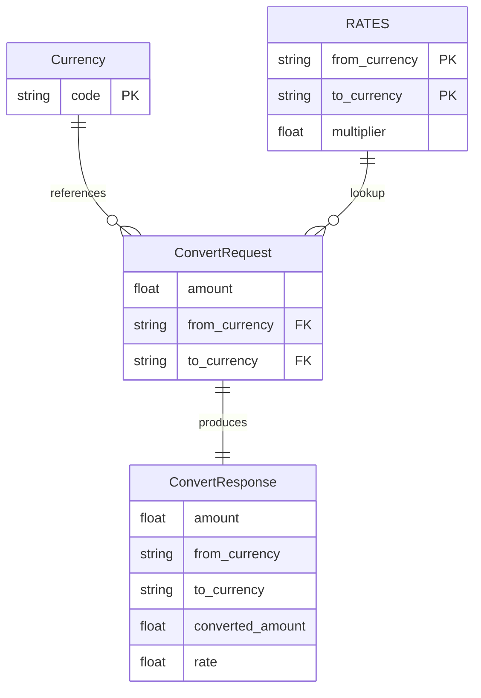

# I1 — ER Diagram from Repo

**Project:** `currency-converter` (separate from `transaction-ledger`)  
**Source:** Code only — no SQL database  
**Date:** 2026-06-16  
**Status:** Complete (agent-suggested, manually verified)

## Summary

Logical entities only. Rates live in an in-memory dict; no persisted tables.

---

## Entities and Primary Keys

### Currency (enum)

| Value | PK | Source |
|-------|----|--------|
| `USD` | Yes | `service/app/models.py` L7 |
| `EUR` | Yes | `service/app/models.py` L8 |
| `GBP` | Yes | `service/app/models.py` L9 |

Not a table — enumeration of allowed currency codes.

---

### ConvertRequest (request DTO)

| Field | Type | PK | Source |
|-------|------|----|--------|
| `amount` | float | | `service/app/models.py` L13 |
| `from_currency` | Currency | | `service/app/models.py` L14 (JSON alias `from`) |
| `to_currency` | Currency | | `service/app/models.py` L15 (JSON alias `to`) |

---

### ConvertResponse (response DTO)

| Field | Type | PK | Source |
|-------|------|----|--------|
| `amount` | float | | `service/app/models.py` L28 |
| `from_currency` | Currency | | `service/app/models.py` L29 |
| `to_currency` | Currency | | `service/app/models.py` L30 |
| `converted_amount` | float | | `service/app/models.py` L31 |
| `rate` | float | | `service/app/models.py` L32 |

---

### RATES (in-memory lookup)

| From | To | Multiplier | Source |
|------|-----|------------|--------|
| USD | EUR | 0.92 | `service/app/converter.py` L7 |
| EUR | USD | 1.09 | `service/app/converter.py` L8 |
| USD | GBP | 0.79 | `service/app/converter.py` L9 |
| GBP | USD | 1.27 | `service/app/converter.py` L10 |
| EUR | GBP | 0.86 | `service/app/converter.py` L11 |
| GBP | EUR | 1.16 | `service/app/converter.py` L12 |
| USD | USD | 1.0 | `service/app/converter.py` L13 |
| EUR | EUR | 1.0 | `service/app/converter.py` L14 |
| GBP | GBP | 1.0 | `service/app/converter.py` L15 |

**Storage:** `dict[tuple[Currency, Currency], float]` — composite PK `(from, to)` — `service/app/converter.py` L6

---

## Foreign Keys and Inferred Relationships

| From | To | Type | Source |
|------|-----|------|--------|
| `ConvertRequest.from_currency` | `RATES` key[0] | lookup | `service/app/converter.py` L23 |
| `ConvertRequest.to_currency` | `RATES` key[1] | lookup | `service/app/converter.py` L23 |
| `ConvertRequest` | `ConvertResponse` | derived (stateless) | `service/app/main.py` L17–24 |

No database-level foreign keys — stateless conversion service.

---

## Mermaid ER Diagram



---

## React UI

Interactive view of this deliverable:

```bash
# Terminal 1 — API (optional, for other pages)
cd currency-converter/service && source .venv/bin/activate
uvicorn app.main:app --reload --port 8001

# Terminal 2 — ER diagram UI
cd currency-converter/frontend
npm install && npm run dev
```

Open **http://127.0.0.1:5173**

Source: `frontend/src/pages/ErDiagramPage.tsx`, `frontend/src/data/erDiagram.ts`

---

## Notes

- Same-currency pairs exist in `RATES` but `POST /convert` rejects `from == to` — `service/app/converter.py` L20–21.
- No physical DB tables — ER reflects application model layer only.
