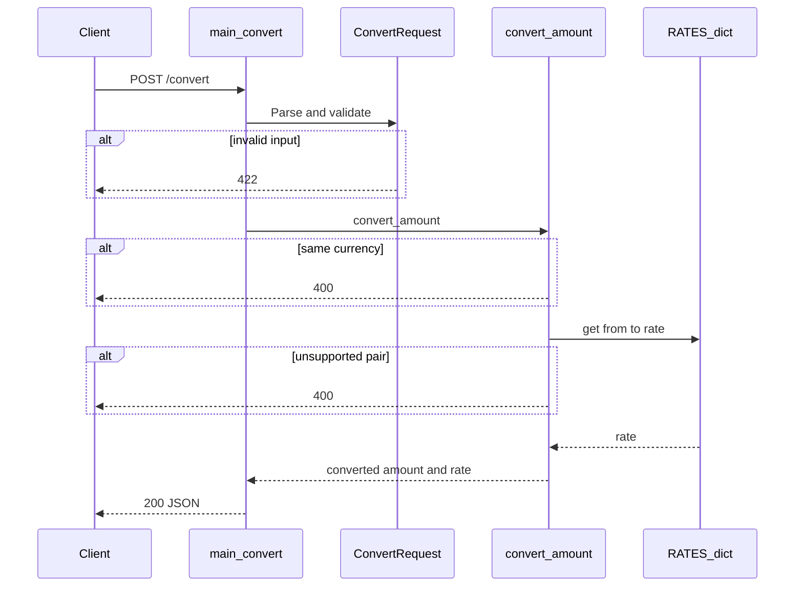

# I2 — End-to-End Flow Trace: POST /convert

**Project:** `currency-converter`  
**Entry point:** `POST /convert`  
**Date:** 2026-06-16

---

## Entry Point

```
POST /convert
Content-Type: application/json
Body: { "amount": 100, "from": "USD", "to": "EUR" }
```

Handler: `convert()` — `service/app/main.py` L16–24

---

## Step-by-Step Path

| Step | File | Function | Action |
|------|------|----------|--------|
| 1 | `service/app/main.py` | `convert()` | Receives HTTP POST |
| 2 | FastAPI + Pydantic | `ConvertRequest` | Validates amount > 0, valid currencies — `service/app/models.py` L12–24 |
| 3 | `service/app/main.py` | `convert_amount(...)` | Delegates to converter |
| 4 | `service/app/converter.py` | `convert_amount()` L19 | Checks from ≠ to; 400 if same |
| 5 | `service/app/converter.py` | `RATES.get(...)` L22 | Lookup hardcoded rate |
| 6 | `service/app/converter.py` | `amount * rate` L26 | Compute converted amount |
| 7 | `service/app/main.py` | Build `ConvertResponse` | Return JSON 200 |

---

## External Dependencies

| Dependency | Used? | Source |
|------------|-------|--------|
| PostgreSQL | No | — |
| External FX API | No | Hardcoded `RATES` |
| Node client | No (separate process) | `client/cli.js` calls this API |

---

## Side Effects

| Type | Detail |
|------|--------|
| Memory read | Lookup in `RATES` dict only |
| DB / queue | None |
| Persistence | None — stateless |

---

## Sequence Diagram



---

## Known Uncertainty

1. Rates are static — no live market data.
2. Cross-rate only defined for direct pairs in `RATES`; no USD-hub fallback for missing pairs.
3. `.env` config loaded but not used on convert path.
