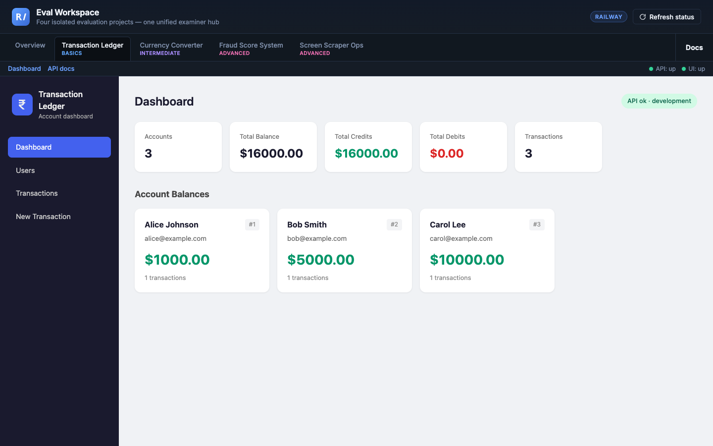
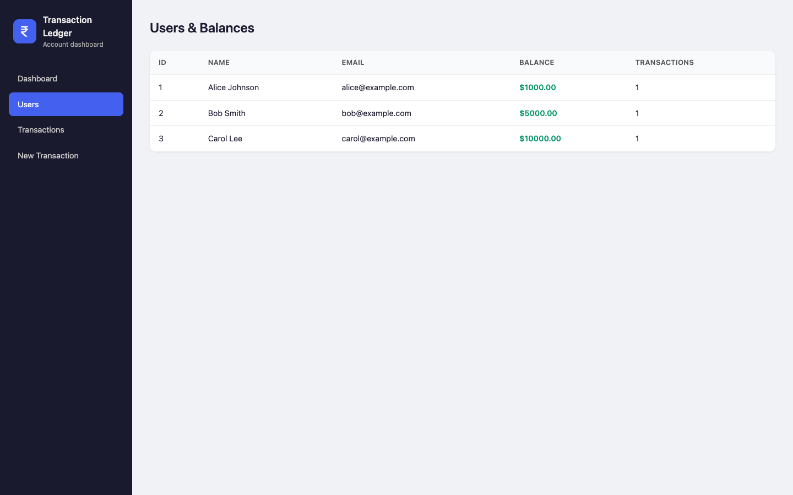
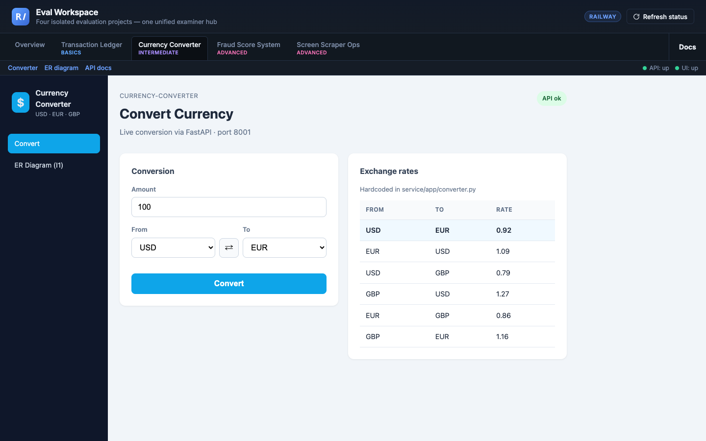
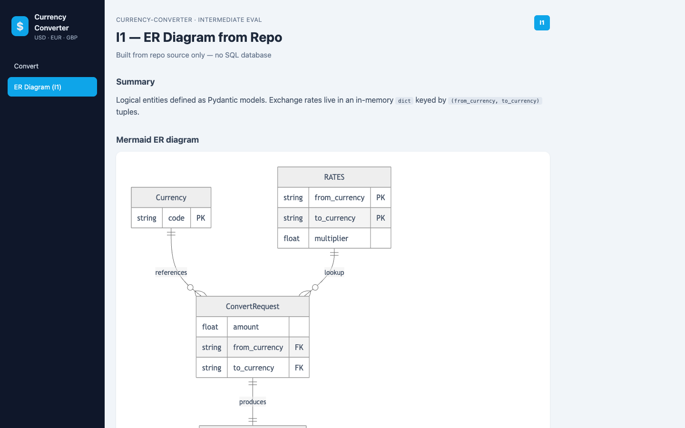
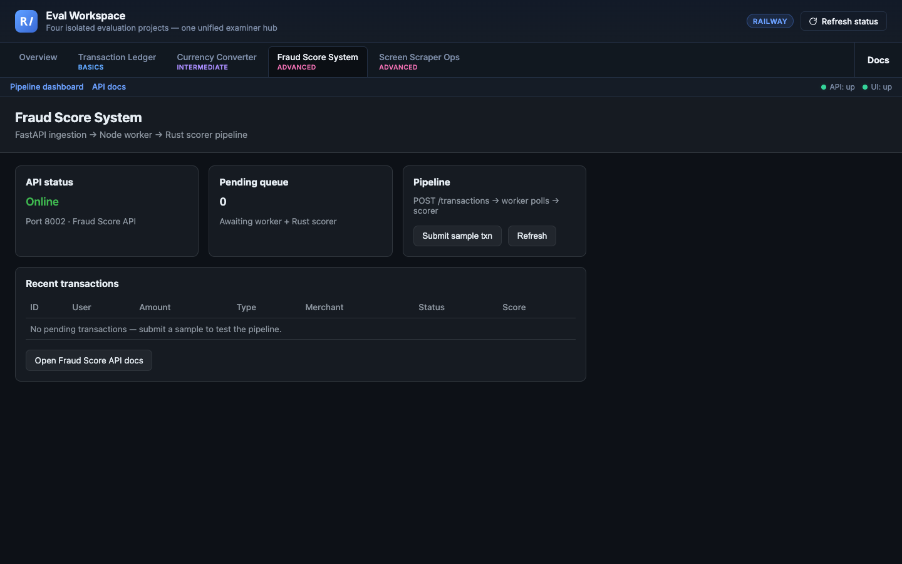
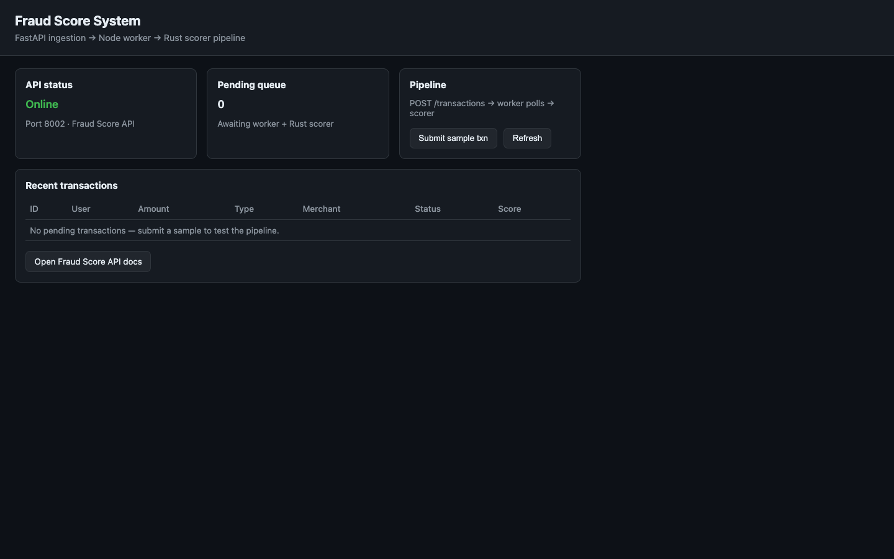
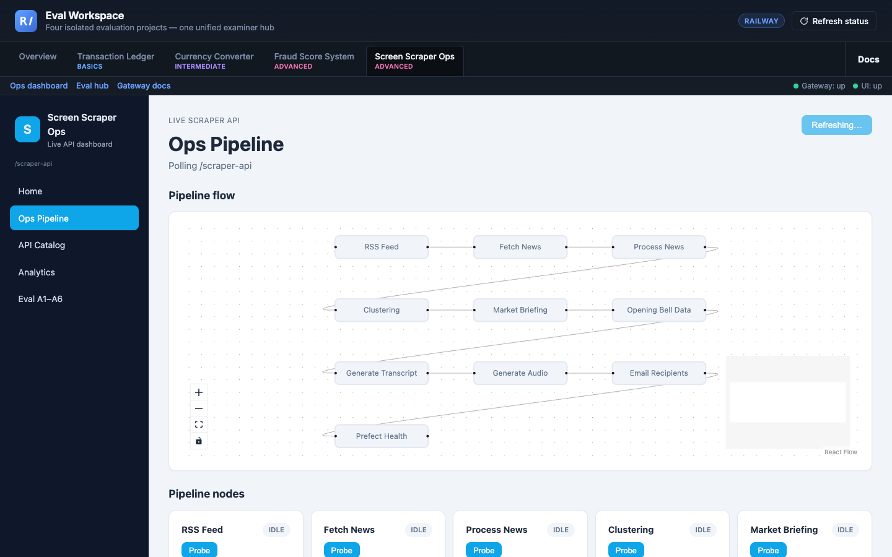
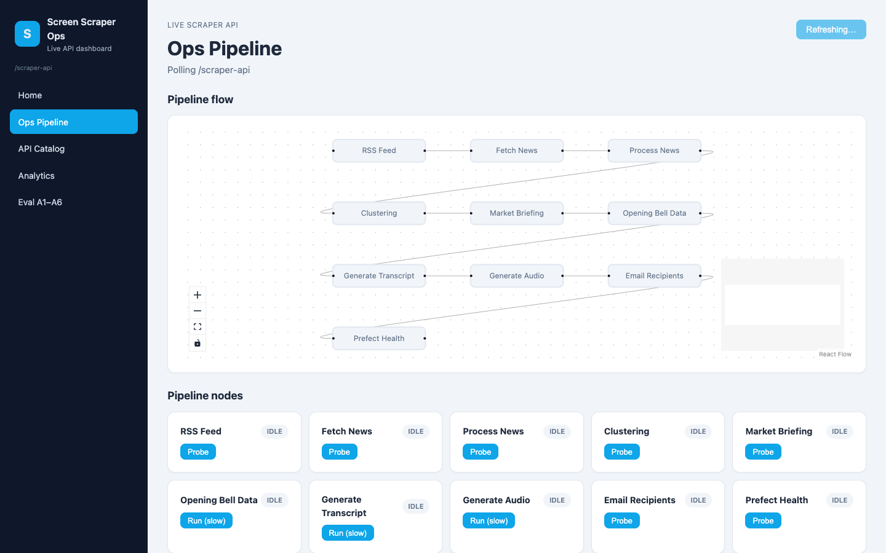

# Complete Projects Guide — Detailed Point-Wise Documentation

**Workspace location:** untitled folder  
**Document purpose:** Full technical understanding for team onboarding  
**Last updated:** 2026-06-17

**IMPORTANT:** All four projects are **INDEPENDENT**. Do not share code, `.env` files, or business logic between them.

## Table of Contents

- PART A — PROJECT 1: Transaction Ledger (Basics Eval)
- PART B — PROJECT 2: Currency Converter (Intermediate Eval)
- PART C — PROJECT 3: Fraud Score System (Advanced Eval)
- PART E — PROJECT 4: Screen Scraper Ops (Advanced Eval + Live API)
- PART D — Comparison and Team Guidelines

---

## PART A — PROJECT 1: TRANSACTION LEDGER

| Field | Value |
|-------|-------|
| Folder name | `transaction-ledger/` |
| Eval tier | Basics (B1, B2, B3, B4) |
| Primary stack | Python 3.11+ \| FastAPI \| Pydantic \| pytest |
| Default port | 8000 |
| Git remote | Local only (not on GitHub) |

### A.1 Overview and Purpose

1. Simulates a simple bank/account ledger system.
2. Users (accounts) can receive **CREDIT** and **DEBIT** transactions.
3. Balance is calculated per account from all past transactions.
4. All data lives in memory — no real database connected yet.
5. Swagger UI available at `http://127.0.0.1:8000/docs`.
6. React dashboard (optional dev) at `http://127.0.0.1:5173`.
7. API routes are prefixed with `/api`.

### A.2 Folder Structure

- **`app/`** — Core application logic (routes, models, store, config).
- **`frontend/`** — React dashboard (Vite).
- **`tests/`** — Automated API tests (`test_api.py`).
- **`docs/eval/`** — Basics and Intermediate evaluation artifacts.
- **`.env`** — Secret management (never commit).

### A.3 Data Model

**User:** Contains `id` (int), `name` (str), and `email` (str). Seeded users include Alice, Bob, and Carol.

**Transaction:** Includes `id`, `account_id`, `amount`, `type` (credit/debit), `description`, and `created_at`.

**BalanceResponse:** Returns `id`, `balance`, and `transaction_count`.

### A.4 Business Rules

1. Transactions must belong to a valid user (ID 1, 2, or 3).
2. Invalid amounts (negative, zero, NaN) return HTTP 422.
3. Debits that result in a negative balance return HTTP 400.
4. Data is volatile and resets upon server restart.

### A.5 API Endpoints

| Method | Endpoint | Description |
|--------|----------|-------------|
| GET | `/api/users` | List seeded users |
| POST | `/api/transactions` | Create new transaction |
| GET | `/api/balance?id={id}` | Get account balance |
| GET | `/api/health` | System health check |

---

## PART B — PROJECT 2: CURRENCY CONVERTER

| Field | Value |
|-------|-------|
| Folder name | `currency-converter/` |
| Eval tier | Intermediate (I1–I6) |
| Primary stack | Python FastAPI + Node.js CLI |
| Default port | 8001 |

### B.1 Core Features

- Converts between USD, EUR, and GBP using hardcoded rates.
- Node.js CLI client communicates with the service over HTTP.
- Rejects same-currency conversions and invalid inputs.
- Docker support provided for containerized execution.
- Git branches specifically designed for bug diagnosis practice (`eval/i6-seeded-bug`).

### B.2 API and CLI

- **POST `/convert`:** Takes amount, from currency, and to currency. Returns converted amount and rate.
- **CLI Usage:** `node cli.js --amount 100 --from USD --to EUR`

---

## PART C — PROJECT 3: FRAUD SCORE SYSTEM

| Field | Value |
|-------|-------|
| Folder name | `Fraud-score-system/` |
| Eval tier | Advanced (A1–A6) |
| Primary stack | Python FastAPI + Node.js Worker + Rust CLI |
| GitHub Remote | https://github.com/Aditya9598/Fraud-score-system.git |

### C.1 The Pipeline

1. **FastAPI:** Ingests transactions and sets status to pending.
2. **Node.js Worker:** Polls for pending work, claims transactions, and pipes data to Rust.
3. **Rust Scorer:** Reads JSON via STDIN, calculates fraud risk (0–100), and outputs JSON.
4. **Worker:** Posts the final score back to the API.

### C.2 Shared Contract

Uses `contract.json` v1.0 to prevent schema drift across different languages and parallel development worktrees.

### C.3 Status Lifecycle

`pending` → `processing` → `scored` (or `failed`).

---

## PART E — PROJECT 4: SCREEN SCRAPER OPS

| Field | Value |
|-------|-------|
| Folder name | `screen-scraper/` |
| Eval tier | Advanced (A1–A6) |
| Primary stack | React Dashboard + FastAPI Gateway + Node Worker + Rust |
| Live API | new-scrapper-provider-dev (VPN required) |

### E.1 Dashboard & Ops

- React dashboard monitors live Web Scraping API endpoints (RSS, Prefect, News Search).
- Status indicators: **Green** (Working), **Red** (Known 500s), **Yellow** (Slow).
- Local Polyglot pipeline (A3) enriches news articles with relevance and risk scores using Rust.

### E.2 Local Pipeline Endpoints (Port 8003)

| Method | Endpoint | Description |
|--------|----------|-------------|
| POST | `/jobs` | Queue a news article for analysis |
| GET | `/jobs/pending` | Poll for articles |
| POST | `/jobs/{id}/score` | Submit analysis results |

---

## PART D — COMPARISON AND GUIDELINES

### D.1 Side-by-Side Comparison

| Feature | Transaction Ledger | Currency Converter | Fraud Score System | Screen Scraper Ops |
|---------|-------------------|-------------------|-------------------|-------------------|
| Tier | Basics | Intermediate | Advanced | Advanced |
| Languages | Python | Python + Node | Python + Node + Rust | React + Py + Node + Rust |
| Port | 8000 | 8001 | 8002 | 8003 |
| Live API | No | No | No | Yes (VPN) |
| Contract | No | No | Yes (v1.0) | Yes (v1.0) |

### D.2 Team Rules

1. **Isolation:** Never mix code or configs between project folders.
2. **Secrets:** Copy `.env.example` to `.env`; never commit actual secrets.
3. **Verification:** Always run tests (`pytest`, `cargo test`, `npm test`) before submitting changes.
4. **VPN:** Screen Scraper requires VPN for live data connectivity.
5. **Progressive Learning:** New members should start with Transaction Ledger and work toward Advanced projects.
