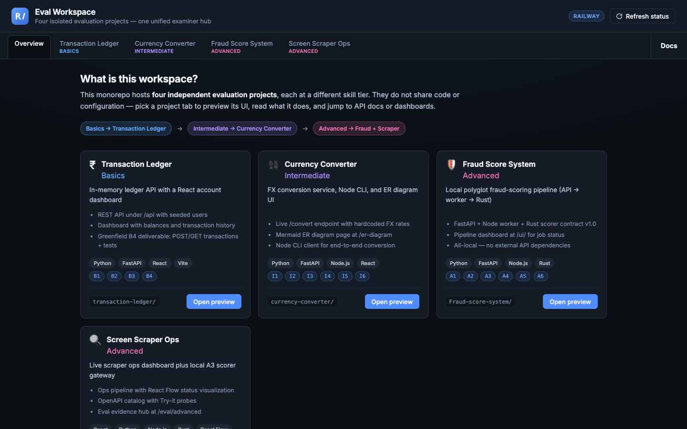
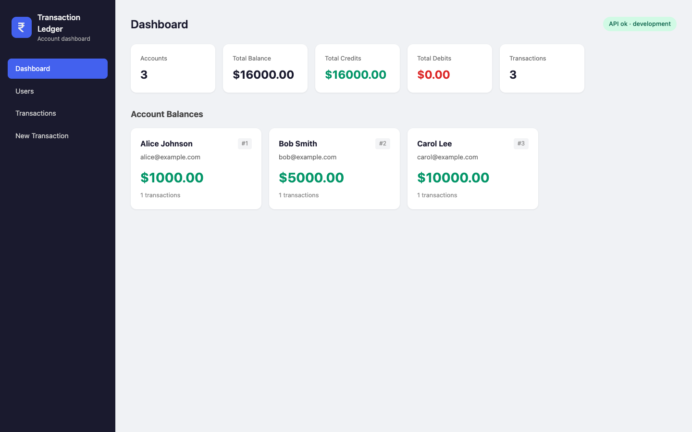
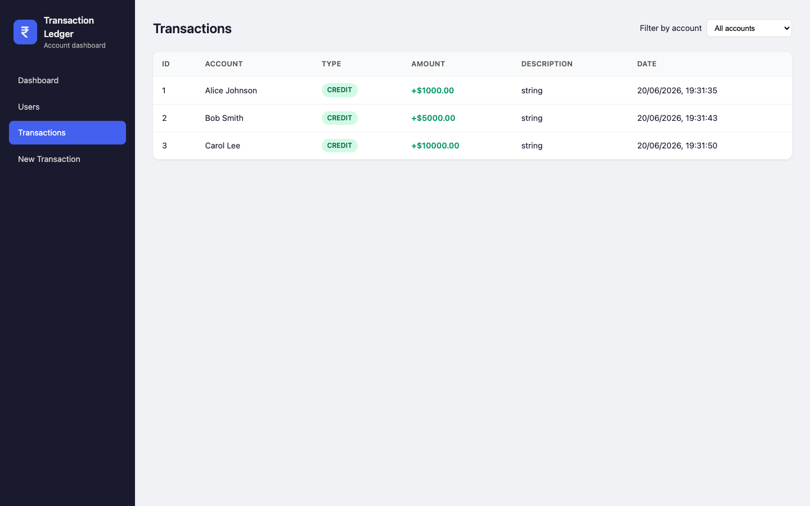

# Projects Overview

## Team Projects Overview

This guide provides a comprehensive summary of the current independent projects within the workspace. These projects are strictly separated; **do not share code, configurations, or environment variables between them.**

**Last Updated:** 2026-06-17  
**Workspace:** untitled folder

## Project Quick Reference

| Project | Folder | Eval Tier | Port(s) | Stack Summary |
|---------|--------|-----------|---------|---------------|
| Transaction Ledger | `transaction-ledger/` | Basics (B1–B3) | 8000, 5173 | Python FastAPI + React |
| Currency Converter | `currency-converter/` | Intermediate (I1–I6) | 8001, 5173 | Python FastAPI + Node CLI + React |
| Fraud Score System | `Fraud-score-system/` | Advanced (A1–A6) | 8002 | FastAPI + Node + Rust |
| Screen Scraper Ops | `screen-scraper/` | Advanced (A1–A6) | 5173, 8003 | React Dashboard + Local Gateway |

## Skill Ladder & Complexity

- **Basics:** Transaction Ledger
- **Intermediate:** Currency Converter
- **Advanced:** Fraud Score System **OR** Screen Scraper Ops

---

## Examiner Hub previews (Railway)

Live workspace: [evaluation-complete-code-production.up.railway.app](https://evaluation-complete-code-production.up.railway.app/)

**Overview** — `https://evaluation-complete-code-production.up.railway.app/`

**Transaction Ledger** — `/#ledger`

**Currency Converter** — `/#converter`

**Fraud Score System** — `/#fraud`

**Screen Scraper Ops** — `/#scraper`

---

## 1. Transaction Ledger

This project features a Python API and React dashboard for managing ledger entries.

- **Routes:** Base routes are under `/api` (e.g. `/api/users`, `/api/transactions`).
- **Data Management:** Utilizes in-memory storage for users and transactions.
- **Key Feature:** Includes a debit overdraft guard.
- **Evaluation Path:** `docs/eval/basics/` (B1–B3) and `docs/eval/intermediate/` (I1–I3).

---

## 2. Currency Converter

A conversion utility involving multiple interfaces and Docker integration.

- **Interfaces:** FastAPI `/convert` endpoint, Node.js `cli.js`, and a React UI with ER diagrams.
- **Rates:** Uses hardcoded USD/EUR/GBP conversion rates.
- **Deployment:** Dockerized on port 8001.
- **Evaluation Path:** `docs/eval/intermediate/` (I1–I6).

---

## 3. Fraud Score System

A fully local, advanced polyglot system designed for high-performance scoring.

- **Architecture:** FastAPI (8002) → Node.js Worker → Rust Scorer.
- **Specification:** Governed by `contract.json` v1.0.
- **Validation:** Use `make test` or `make e2e` for verification.
- **Evaluation Path:** `docs/eval/advanced/` (A1–A6).

---

## 4. Screen Scraper Ops

A hybrid advanced project combining live API interaction with local processing.

- **Components:** React dashboard calling a **LIVE** Web Scraping API via VPN, plus a local scorer-gateway (8003) using Rust for article scoring.
- **Dashboard Features:**
  - `/ops` — Pipeline operations using React Flow.
  - `/apis` — API catalog and "Try-it" functionality.
  - `/analytics` — Timing metrics and A6 performance charts.
  - `/eval/advanced` — A1–A6 hub with clickable documentation.
- **Note:** Some dev endpoints may return 500 errors; the dashboard displays these via real probes.

---

## Team Rules & Workflow

1. **Isolation:** Never mix the four project folders or their dependencies.
2. **Port Mapping:**
   - **8000** — Ledger
   - **8001** — Converter
   - **8002** — Fraud System
   - **8003** — Scraper Gateway
   - **5173** — React Dev UI (shared across Ledger, Converter, and Scraper)
3. **Validation:** Run all relevant tests (`pytest`, `cargo test`, `npm test`, `make test`) before marking tasks as complete.
4. **Network:** VPN is required for the screen-scraper dashboard to access live APIs.
5. **Git Protocol:** Do not merge `review/agent-pr-seeded` branches into `main`.

## Supporting Documentation

| Document | Purpose |
|----------|---------|
| `PROJECTS_DETAILED_GUIDE.txt` | Point-wise technical guide for all four projects |
| `EVAL_AND_PROJECTS_GUIDE.md` | Eval tasks ↔ workspace evidence (for examiners) |
| `PROJECTS_OVERVIEW.md` | Markdown-formatted version of this summary |
