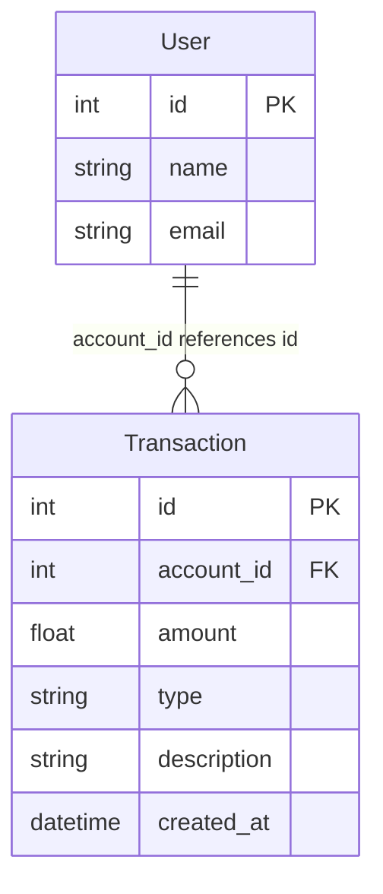

# I1 — ER Diagram from Repo

**Repo:** `transaction-ledger`  
**Source:** Code only (no SQL migrations; in-memory persistence)  
**Date:** 2026-06-16

## Summary

This service uses **logical entities** defined as Pydantic models. Data is stored in Python in-memory structures (`dict` for users, `list` for transactions), not PostgreSQL tables. PostgreSQL credentials exist in `.env` for future use but are not wired to persistence yet.

---

## Entities and Primary Keys

### User

| Field | Type | PK | Source |
|-------|------|----|--------|
| `id` | int | **Yes** | `app/models.py` L42–45 |
| `name` | str | | `app/models.py` L44 |
| `email` | str | | `app/models.py` L45 |

**Storage:** `UserStore._users: dict[int, User]` — `app/store.py` L12

---

### Transaction

| Field | Type | PK | Source |
|-------|------|----|--------|
| `id` | int | **Yes** (auto `_next_id`) | `app/models.py` L28; assigned in `app/store.py` L53, L60 |
| `account_id` | int | | `app/models.py` L29; set from `payload.id` in `app/store.py` L54 |
| `amount` | float | | `app/models.py` L30 |
| `type` | TransactionType | | `app/models.py` L31 |
| `description` | Optional[str] | | `app/models.py` L32 |
| `created_at` | datetime | | `app/models.py` L33; set in `app/store.py` L58 |

**Storage:** `TransactionStore._transactions: list[Transaction]` — `app/store.py` L46

---

### TransactionType (enum, not a table)

| Value | Source |
|-------|--------|
| `credit` | `app/models.py` L9 |
| `debit` | `app/models.py` L10 |

---

### Request/Response DTOs (not persisted)

| Entity | Purpose | Source |
|--------|---------|--------|
| `TransactionCreate` | POST body; `id` = account id | `app/models.py` L13–24 |
| `BalanceResponse` | GET /balance response | `app/models.py` L36–39 |

---

## Foreign Keys and Inferred Relationships

| From | To | Relationship | Enforcement | Source |
|------|-----|--------------|-------------|--------|
| `Transaction.account_id` | `User.id` | many-to-one | `UserStore.require()` before add/list/balance | `app/store.py` L50, L66, L72 |
| `TransactionCreate.id` | `User.id` | maps to `Transaction.account_id` | on create | `app/store.py` L54 |

No database-level FK constraints exist (in-memory only).

---

## Mermaid ER Diagram

---

## Notes

- **No physical DB tables** — ER reflects application model layer only.
- `DATABASE_URL` in `.env` / `app/config.py` is configured but not used by stores yet.
- Seeded users (ids 1–3): `app/store.py` L16–20.
