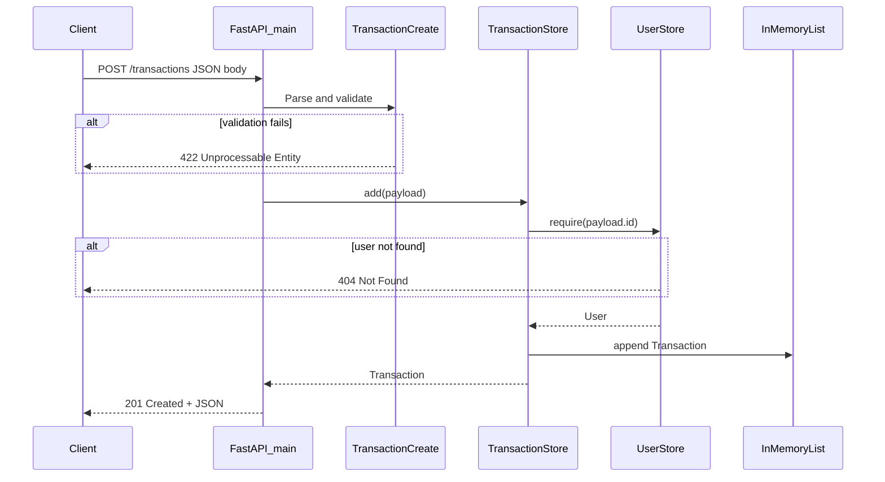

# I2 — End-to-End Flow Trace: POST /transactions

**Repo:** `transaction-ledger`  
**Entry point:** `POST /transactions`  
**Date:** 2026-06-16

---

## Entry Point

```
POST /transactions
Content-Type: application/json
Body: { "id": 1, "amount": 100, "type": "credit", "description": "Deposit" }
```

Handler: `create_transaction()` — `app/main.py` L27–29

---

## Step-by-Step Path

| Step | File | Function / Component | Action |
|------|------|----------------------|--------|
| 1 | `app/main.py` | `create_transaction()` | Receives HTTP POST |
| 2 | FastAPI + Pydantic | `TransactionCreate` | Validates body (`id` > 0, `amount` > 0, valid `type`) — `app/models.py` L13–24 |
| 3 | `app/main.py` | `store.add(payload)` | Delegates to transaction store |
| 4 | `app/store.py` | `TransactionStore.add()` L49 | Business logic entry |
| 5 | `app/store.py` | `UserStore.require(payload.id)` L50 | Verifies user exists; 404 if not — L27–31 |
| 6 | `app/store.py` | Build `Transaction` L52–59 | Assigns auto `id`, maps `payload.id` → `account_id` |
| 7 | `app/store.py` | `_transactions.append()` L61 | **Side effect:** persist to in-memory list |
| 8 | `app/main.py` | FastAPI response | Returns `Transaction` JSON, HTTP 201 |

---

## External Dependencies

| Dependency | Used on this path? | Source |
|------------|-------------------|--------|
| PostgreSQL | No | Credentials in `.env`; not connected to stores |
| External APIs | No | — |
| Message queues | No | — |
| `.env` / `app/config.py` | No | Config loaded at startup but not read in this flow |

---

## Side Effects

| Type | Detail |
|------|--------|
| **Memory write** | Append one `Transaction` to `TransactionStore._transactions` (`app/store.py` L61) |
| **Counter increment** | `_next_id` += 1 (`app/store.py` L60) |
| **DB** | None |
| **Queue** | None |

Data is lost on server restart.

---

## Sequence Diagram



---

## Known Uncertainty

1. **No durable persistence** — flow ends in Python list, not PostgreSQL despite `.env` DB config.
2. **No debit balance check** (as of pre-I3 baseline) — debits always accepted if user exists.
3. **Concurrent requests** — no locking on `_next_id` or list append (single-process dev server assumed).
